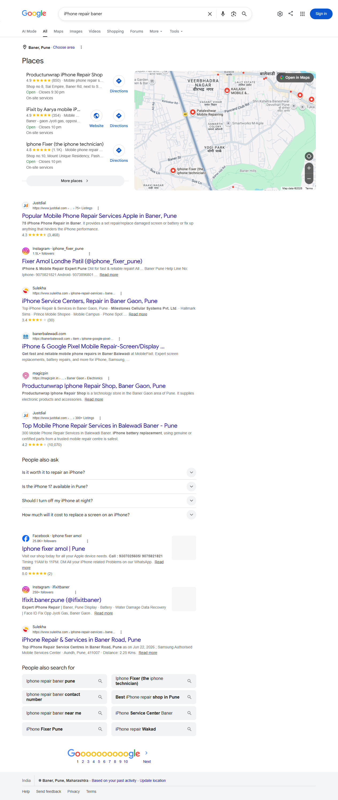
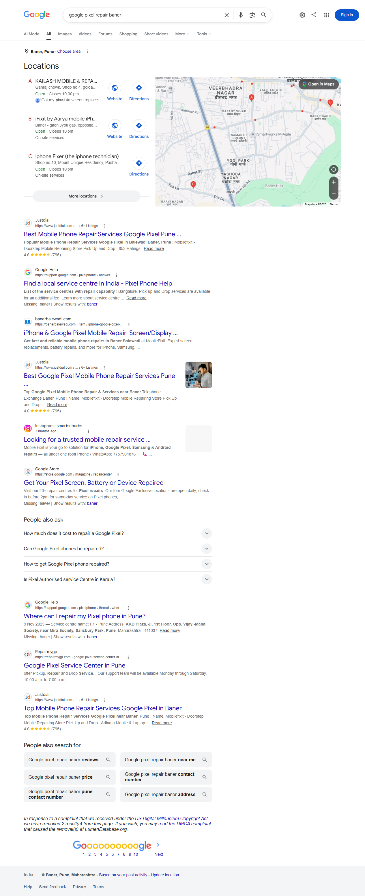
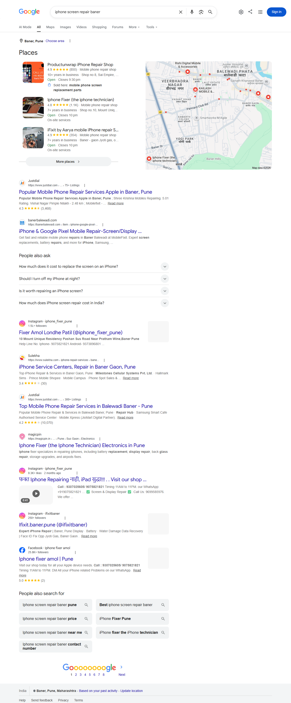
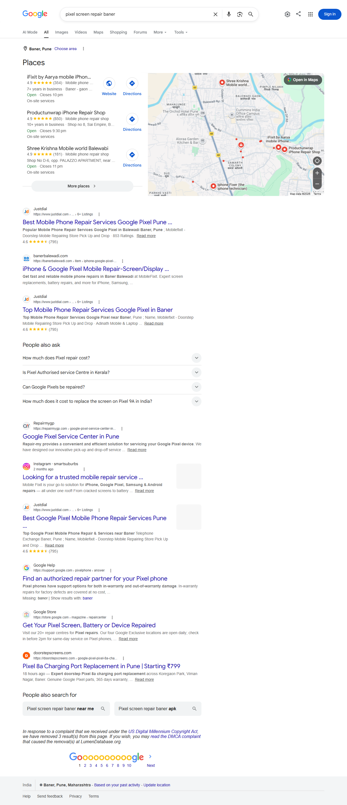

<div align="center">

# 🤖 RTILA SEO Automation Agent

### Automated Google Search Ranking Verification using RTILA X

[]()
[]()
[]()
[]()
[]()

Automating Google Search verification for Digital Marketing using **RTILA X**.

---

</div>

# 📌 Project Overview

This project was developed during my **Digital Marketing & Agentic AI Internship** to automate Google Search verification for SEO monitoring.

The automation workflow reads a target webpage URL and a list of keywords, launches **Google Chrome in Incognito Mode**, performs Google searches, verifies whether the specified webpage appears in the search results, and captures screenshots for reporting.

The objective is to eliminate repetitive manual SEO verification and improve the efficiency of digital marketing workflows.

---

# 🎯 Problem Statement

Digital marketing teams frequently need to verify whether client webpages are ranking for target keywords on Google.

Performing this process manually is:

- Time-consuming
- Repetitive
- Error-prone
- Difficult to scale

This RTILA automation workflow streamlines the verification process by automatically searching multiple keywords and collecting visual evidence.

---

# 🚀 Features

✅ Reads Target URL

✅ Reads Multiple Keywords

✅ Opens Chrome in Incognito Mode

✅ Navigates to Google Search

✅ Searches Keywords Automatically

✅ Verifies Target URL Presence

✅ Captures Screenshot When Found

✅ Generates Evidence for SEO Reporting

---

# ⚙️ Workflow

```text
                ┌────────────────────┐
                │  Target URL Input  │
                └─────────┬──────────┘
                          │
                          ▼
              ┌──────────────────────┐
              │ Read Keywords Dataset │
              └─────────┬────────────┘
                        │
                        ▼
          ┌────────────────────────────┐
          │ Launch Chrome (Incognito)  │
          └─────────┬──────────────────┘
                    │
                    ▼
          ┌────────────────────────────┐
          │ Open google.co.in          │
          └─────────┬──────────────────┘
                    │
                    ▼
          ┌────────────────────────────┐
          │ Search Next Keyword        │
          └─────────┬──────────────────┘
                    │
                    ▼
        ┌──────────────────────────────┐
        │ Check if Target URL Exists   │
        └───────┬───────────┬──────────┘
                │Yes        │No
                ▼           ▼
      Capture Screenshot   Continue
                │
                ▼
        Next Keyword
                │
                ▼
             Finished
```

---

# 🛠 Technologies Used

| Technology | Purpose |
|------------|---------|
| RTILA X 8.3.12 | Browser Automation |
| Google Chrome | Automated Browser |
| Google Search | Search Engine |
| CSV/TXT Dataset | Input Keywords |
| SEO Automation | Search Verification |
| Digital Marketing | Business Use Case |

---

# 📂 Repository Structure

```
RTILA-SEO-Automation-Agent/

│── assets/
│     ├── demo.mp4
│     ├── screenshot1.png
│     ├── screenshot2.png
│     ├── screenshot3.png
│     ├── screenshot4.png
│
│── sample_data/
│     ├── keywords.txt
│     └── url.txt
│
│── README.md
│── LICENSE
│── .gitignore
```

---

# 📄 Sample Input

### Target URL

```
https://banerbalewadi.com/item/iphone-google-pixel-mobile-repair-screen-display-damage-in-baner-balewadi/
```

### Keywords

```
iPhone repair baner
google pixel repair baner
iphone screen repair baner
pixel screen repair baner
```

---

# 📸 Automation Results

## Search Result 1



---

## Search Result 2



---

## Search Result 3



---

## Search Result 4



---


## 🎥 Live Demo

<p align="center">
  
</p>

---

# 💼 Business Impact

This automation significantly reduces the manual effort required for SEO ranking verification.

### Benefits

- Faster keyword verification
- Reduced manual work
- Consistent reporting
- Improved productivity
- Visual proof through screenshots

---

# 🔍 Challenges Faced

- Google search result variations
- Dynamic webpage loading
- URL identification
- Browser timing synchronization
- Handling multiple keywords sequentially

---

# 🔮 Future Improvements

- Read keywords directly from CSV
- Export results to Excel
- Email automation reports
- Schedule automatic execution
- AI-based ranking analysis
- Multi-search engine support
- Playwright/Python integration

---

# 💡 Internship Learning

During this project, I gained hands-on experience with:

- Browser Automation
- RTILA X
- Digital Marketing Workflows
- SEO Verification
- Google Search Automation
- Workflow Design
- Automation Debugging
- Agentic Automation Concepts

---

# 📈 Resume Highlights

- Developed an automation workflow using **RTILA X 8.3.12** to automate Google Search ranking verification.
- Automated browser interactions including keyword search, URL verification, and screenshot capture.
- Reduced repetitive manual SEO verification through workflow automation.
- Processed multiple search keywords using external datasets.

---

# 👩‍💻 Author

**Ritika Singh**

Final Year B.Tech Electronics & Telecommunication Engineering

Pimpri Chinchwad College of Engineering (PCCOE)

GitHub: https://github.com/ritika28singhh-blip

---

# ⭐ If you found this project interesting

Please consider giving it a ⭐ on GitHub.
